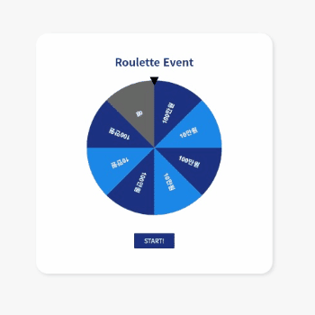

# 🎰Roulette Event

[Winwheel.js](http://dougtesting.net/winwheel/downloads)는 HTML 캔버스에서 룰렛을 쉽게 만들어 주는 Javascript 라이브러리입니다.  
[GSAP](https://greensock.com/gsap/) 라이브러리를 활용한 애니메이션으로 생동감 넘치는 애니메이션 작업이 가능하고 내장된 설정들을 활용해 룰렛의 회전속도, 지속시간, 스타일등 다양한 요소들을 꾸밀 수 있습니다.

이 Roulette Event는 이 Wheel.js 라이브러리를 이용하여 룰렛을 생성하고  Javascript `Math.random()` 함수로 난수를 생성하여 당첨확률을 조정할 수 있도록 하는 룰렛입니다. 즉, 세그먼트의 수와 당첨확률을 별개로 설정할 수 있는 이벤트 UI입니다.
  
쇼핑몰이나 게임 등의 이벤트에 접목시켜 사용자의 참여를 효과적으로 유도할 수 있습니다.

[📃Demo](http://kyoungsic.com/projects/roulette)
